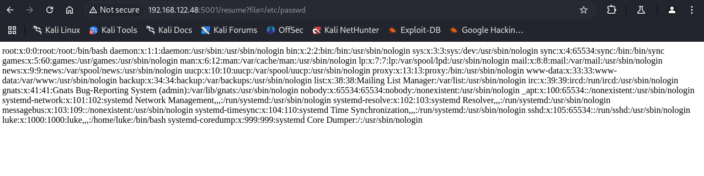
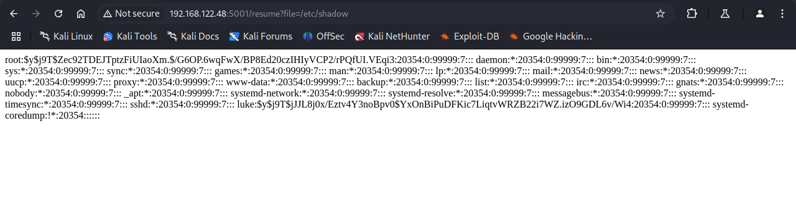
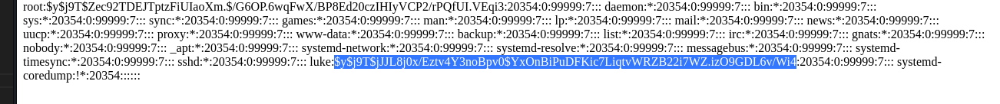
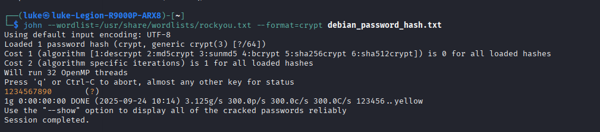
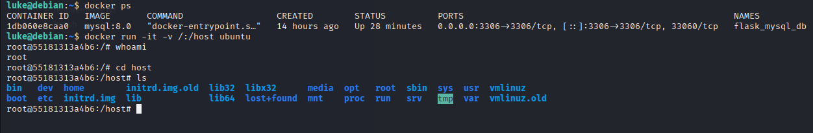

# Pentest Website
## Detect LFI 
http://192.168.122.48:5001/resume?file=pages/resume.html, with this type of Url, it is easy to cause LFI error, so we 
can check by many methods such as fuzzing

## Exploit 
try reading more information in /etc/shadow, with this result, we can see this app is running with root privileges.

## Crack Password Luke User
there are 2 users root and luke, i used John the Ripper to crack these 2 passwords, but root user's password is too strong, so it can't be cracked, while luke user's password is simpler, so i cracked its password

## Foothold
Use the User and password you just got to ssh into the server

## Privilege Escalation
Privilege escalation using docker (in case user belongs to docker group)
